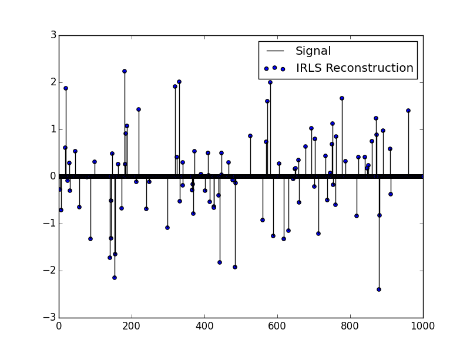
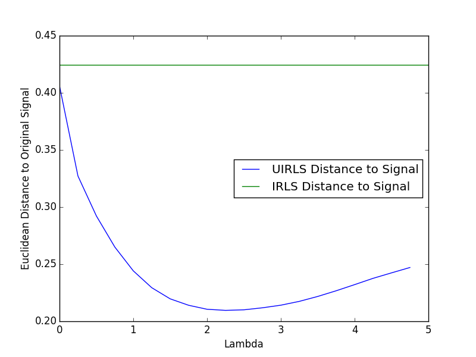

# CompressiveSensing

This package contains several useful algorithms for compressive sensing, multiple measurement vectors, and sparse blind source separation.

*This package is under heavy editing currently, expect changes!*

##Available Algorithms

#####SMV - Single Measurement Vectors
- *IRLS* - Equality constrained Iteratively Rewieghted Least Squares Lp Minimization [1][bib1]
- *UIRLS* - Unconstrained Iteratively Reweighted Lease Squares Lp Minimization [1][bib1]

#####MMV - Multiple Measurement Vectors
- *ZAP* - Zeropoint Attractor [2][bib2]

#####BSS - Sparse Blind Source Separation
- *nGMCA* - Sparse non-negative Blind Source Separation [3][bib3]

#####Quantifying Sparsity
- *GI* - Absolute Gini Index [4][bib4]
- *Coherence* - Measuring the coherence of a measurement matrix by the definitions commonly used [5][bib5] 


##Functions

#####IRLS( MeasurementMatrix , Measurement ; x...)
This function reconstructs a signal using equality constrained Lp minimization, where 0 < p <= 1.
It accepts these options:
- *verbose = false* - Print iteration and convergence information
- *maxiter = 1000* - The maximum number of iterations before giving up.
- *p = .5* - The p in Lp
- *theshold = 1e-5* - Threshold for convergence, the smaller the number the more the algorithm onverges.
- *eps = x->1/x^3* - A function that converges to 0 as x->Inf. The faster eps approaches 0 the faster the algorithm converges, however it also becomes more likely to fail.  1/x^3 seems to be something of a conservative setting, resulting in good convergence at the cost of taking slightly more time to run.
- *debug = false* - Returns additional output.

#####UIRLS( MeasurementMatrix , Measurement ; x...)
This function reconstructs a signal using unconstrained Lp minimization, where 0 < p <= 1. This algorithm can generally reconstruct noisy signals better then the IRLS function.
It accepts the same options as IRLS, with one addition:
- *lambda = 1* - This value is the tradeoff between finding a sparser solution and a solution that is closer to the measured output. It is in essence a measure of how much noise is expected in the measurement. Smaller lambdas would tend to mean there is less noise, so the solution approaches IRLS as lambda goes to 0. lambda>0. See [[1]][bib1]

These functions returns a vector of the reconstructed signal.

------
#####nGMCA( Y , r ; x...)
An implementation of the algorithm presented in [[3]][bib3]. This takes a matrix and performs [blind source separation](http://en.wikipedia.org/wiki/Blind_signal_separation) with the added restrictions that the source signals and mixing matrix be as sparse (L1 sparsity) as possible, and non-negative. In addition to the starting matrix, the number of components must be specified.  Additional Options:
- *verbose = false* - Print iteration and convergence information.
- *maxIter = 5000* - maximum number of iterations before giving up.
- *threshold = 1e-6* - threshold for convergence.
- *phaseRatio=0.30*  - there are 2 stages of convergence, this is the ratio of time spent on either stage.  This should probably not be edited except when algorithm isn't converging properly.
- *kickstart=true* - this runs an initial fitting step without using the algorithm, greatly improving the speed of intial convergence.

It returns two matricies, that when multiplied together result in the closest to the input matrix as possible.
`return {A,S}`

------
#####GI( X )
This is the absolute gini index, which is an excelent measure of sparsity, see [[4]][bib4].  This function accepts any vector or matrix of numbers and returns a value from 0 to 1, with 1 being as sparse as possible.

#####Coherence( X )
This is an implementation of the standard coherence measure used with the RIP, the definition can be seen in [[5]][bib5]. X must be a matrix. 

##Examples

####[IRLS - Example 1](./examples/Example 1.jl)

```julia

n=1000   #Signal Dimensions
m=400    #Measurement Dimension
k=100    #Approximate Sparsity

Signal = zeros(n)     #Create a random sparse signal
Signal[int(rand(k)*(n-1)+1)] = randn(k)

MM = randn(m,n)     #Create a random measurement matrix
Measurement = MM*Signal  #Measure the signal using the measurement matrix

#Reconstruct using IRLS
Reconstruction = IRLS(MM,Measurement,verbose=true)
```



####[UIRLS w/ Noise - Example 2](./examples/Example 2.jl)
Taking the signal and measurement matrix from example 1:
```julia
Noise = randn(m)*.3
Measurement += Noise  #Add ~30% noise to the measurement and reconstruct

#reconstruct using IRLS and UIRLS at multiple lambdas
IRLS(MM,Measurement)
UIRLS(MM,Measurement,lambda=.1)
```


####[Gini Index - Example 3](./examples/Example 3.jl)
The gini index is an excelent measure of the sparsity of a dataset, a full discussion of its benefits are discussed in [[4]][bib4].  To briefly see the benefit, we can look at the difference between GI and L0 as a measure of sparsity on noisy and non-noisy data.  Here we have made 2 vectors of length 100, one without noise and one with noise. The noiseless vector starts set to 0, and each element is incrementally set to 1.  Taking the L0 sparsity of this, we get the expected result of 1,2,3 etc. However if we add a small amount of noise to the vector, the L0 sparsity is fixed at 100. A comparison to the GI is visible.

~[GI Index Example](./examples/Example_3_Fig_1.png)


[bib1]:http://www.sciencedirect.com/science/article/pii/S092523121300430X
[bib2]:http://arxiv.org/pdf/1203.1548.pdf
[bib3]:http://arxiv.org/pdf/1308.5546.pdf
[bib4]:http://arxiv.org/pdf/0811.4706.pdf
[bib5]:http://cmc.edu/pages/faculty/DNeedell/papers/redundant.pdf